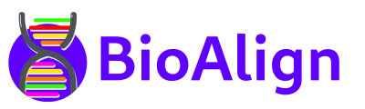

# BioAlign

&nbsp;

&nbsp;

&nbsp;

A web app for string alignment algorithms used in bioinformatics courses

## Supported algorithms

- [Levenshtein distance](https://en.wikipedia.org/wiki/Levenshtein_distance)
- [Needleman–Wunsch](https://en.wikipedia.org/wiki/Needleman%E2%80%93Wunsch_algorithm)
- [Longest Common Subsequence](https://en.wikipedia.org/wiki/Longest_common_subsequence_problem)
- [Smith–Waterman algorithm](https://en.wikipedia.org/wiki/Smith%E2%80%93Waterman_algorithm)

## Development

Clone this repo and start the dev server with `npm run start`.

To add a new algorithm:

- go in logic and add here a new file for the calculation

- add a new entry to the exported object

- (not required) add a new test file

- check if everything works fine!

Feel free to do PRs for bugfixes or new functionalities. Thanks in advance!
